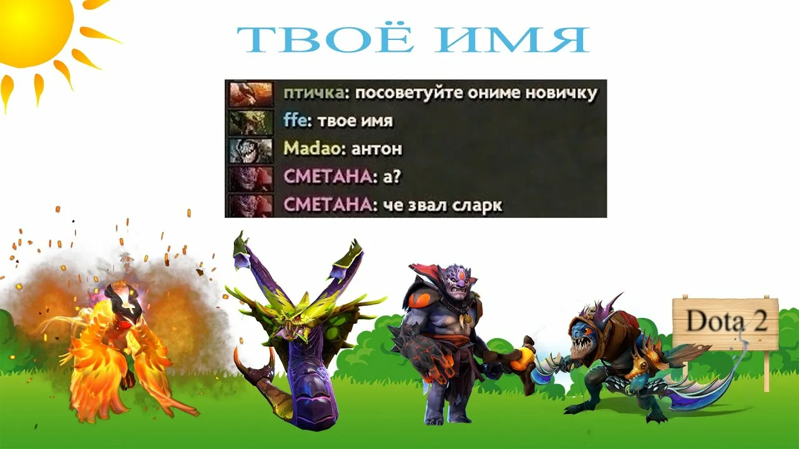

# Константинов `Junior Web Developer`

#### Оглавления

- [Обо мне](#обо-мне)
- [Технологический стек](#технологический-стек)
- [Цели и план обучения](#цели-и-план-обучения)
- 


#Обо мне

Привет! Я обучаюсь по специальности «Информационные системы и программирование». Сейчас мой фокус — переход от хаотичного кликанья мышью в проводнике к строгой инженерной дисциплине: командной строке, работе с системами контроля версий Git и созданию читаемого кода.
> [!Note]
> В данный момент я активно ищу учебную практику или ментора по направлению **Frontend / DevOps.**

> [!Tip}
> При написании коммитов я строго придерживаюсь формата Conventional Commits: `feat:`, `fix:`, `refactor:`, `docs:`.

`pwd`[^1]
``` python
print('Hello')
```
|"ЖИРНЫЙ"||"жирный"|
|---| |---|

